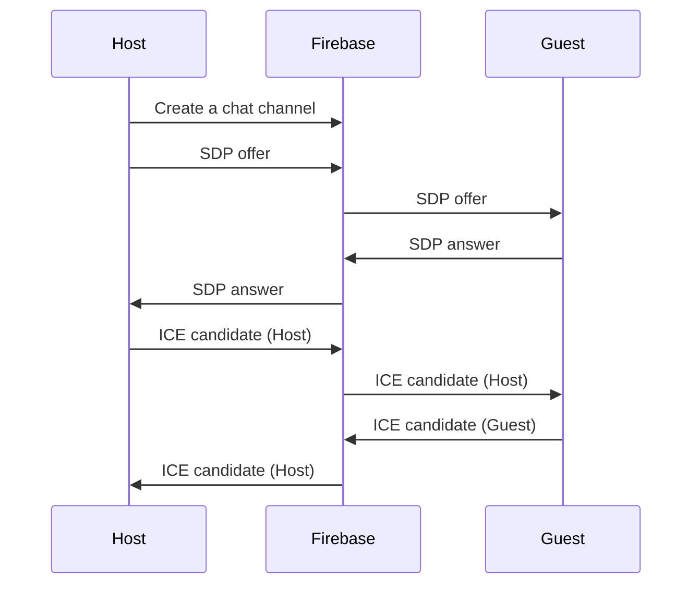

# WebRTC iOS VideoChat

This is an example implementation of iOS WebRTC video VideoChat.

Establishing [WebRTC](https://developer.mozilla.org/en-US/docs/Web/API/WebRTC_API) connection consists of multiple asynchronous steps where data is exchanged over the network
* communication with [STUN/TURN servers](https://developer.mozilla.org/en-US/docs/Web/API/WebRTC_API/Protocols)
* communication with [signaling server (Firebase in this case)](https://developer.mozilla.org/en-US/docs/Web/API/WebRTC_API/Connectivity#signaling)

 Error handling and connection reset is tricky and can result in [callback hell](http://callbackhell.com/)   

The project presents:
* approach to establishing a reliable WebRTC connection every time two peers try to connect to each other.
* error handling and reliable connection reset

Technologies used:
* WebRTC
* Swift programming language
* Swift structured concurrency
* SwiftUI
* Firebase firestore

```Swift
try await withThrowingTaskGroup(of: Void.self) { group in
    group.addTask {
        if let rtcSessionDescription = try await signalingClient.getRTCSessionDescriptions(
            currentPeer.watchKey,
            chatRoomId
        ).first(where: { _ in true }) {
            try await webRTCClient.set(remoteSdp: rtcSessionDescription)
            connectionStateContainer.info = "Remote SDP set"
            if currentPeer == .guest {
                let sdp = try await webRTCClient.answer()
                try await signalingClient.send(sdp: sdp, chatRoomId: chatRoomId, collection: currentPeer.sendKey)
                connectionStateContainer.info = "SDP answer sent"
            }
        }
    }
    if currentPeer == .host {
        group.addTask {
            let sdp = try await webRTCClient.offer()
            try await signalingClient.send(sdp: sdp, chatRoomId: chatRoomId, collection: currentPeer.sendKey)
            connectionStateContainer.info = "SDP offer sent"
        }
    }
    group.addTask {
        for _ in 1...40 {
            if webRTCClient.isRemoteDescriptionSet {
                return
            }
            try await Task.sleep(milliseconds: 100)
        }
        connectionStateContainer.info = "Connection timeout"
        throw connectionError.connectionTimeoutError
    }
    try await group.waitForAll()
}
connectionStateContainer.info = "RTC exchanged"
try await withThrowingTaskGroup(of: Void.self) { group in
    group.addTask {
        for try await candidate in signalingClient.getCandidates(currentPeer.watchKey, chatRoomId) {
            try await webRTCClient.set(remoteCandidate: candidate)
        }
        connectionStateContainer.info = "Candidates set"
    }
    group.addTask {
        for await state in webRTCClient.getConnectionState() where state == .failed {
            connectionStateContainer.info = "Connection failed"
            throw connectionError.connectionFailed
        }
    }
    group.addTask {
        try await Task.sleep(seconds: 15)
        if connectionStateContainer.state != .connected {
            connectionStateContainer.info = "Connection timeout"
            throw connectionError.connectionTimeoutError
        }
    }
    group.addTask {
        // peer has deleted sdp and candidates - reset connection
        try await signalingClient.waitUntilSdpAndCandidatesDeleted(
            collection: currentPeer.watchKey,
            chatRoomId: chatRoomId)
        connectionStateContainer.info = "Peer connection reset"
        throw connectionError.connectionReset
    }
    try await group.waitForAll()
}
```


Core algorithm:


Firebase as signaling server


