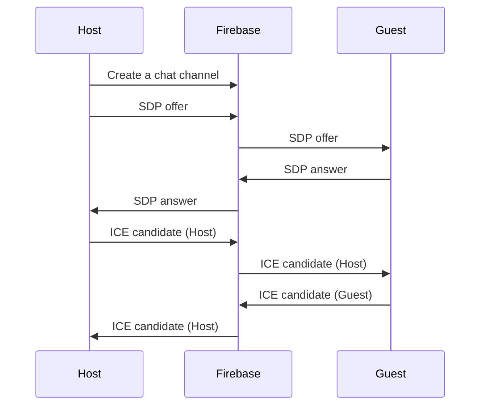

# WebRTC iOS VideoChat

This is an example implementation of iOS WebRTC video VideoChat.

Establishing [WebRTC](https://developer.mozilla.org/en-US/docs/Web/API/WebRTC_API) connection consists of multiple asynchronous steps where data is exchanged over the network
* communication with [STUN/TURN servers](https://developer.mozilla.org/en-US/docs/Web/API/WebRTC_API/Protocols)
* communication with [signaling server (Firebase in this case)](https://developer.mozilla.org/en-US/docs/Web/API/WebRTC_API/Connectivity#signaling)

 Error handling and connection reset is tricky and can result in [callback hell](http://callbackhell.com/)   

The project presents:
* approach to establishing a reliable WebRTC connection every time two peers try to connect to each other.
* error handling and reliable connection reset

Technologies used:
* [WebRTC](https://developer.mozilla.org/en-US/docs/Web/API/WebRTC_API)
* [Swift programming language](https://docs.swift.org/swift-book/)
* [Swift structured concurrency](https://docs.swift.org/swift-book/LanguageGuide/Concurrency.html)
* [SwiftUI](https://developer.apple.com/xcode/swiftui/)
* [Firebase firestore](https://firebase.google.com/docs/firestore)

## Core algorithm

Two peers connecting to each other are called: `host` and `guest`. Core algorithm consists of two main steps:
* SDP exchange
* ICE candidates exchange

Each step has a timeout associated to it - if the step is not completed within the timeframe the whole flow is reset.
The flow can also be reset due to peer clearing it's connection data (SDP, ICE candidates) on signaling server. Clearing connection data is done in the outer connection loop. This could happen e.g. due to connection timeout.

```mermaid
flowchart TD
    S[Start]-->A
    A[SDP exchange] -->|SDP exchange timeout| B{Timeout?}
    B -->|Reset connection| S
    A --> C{Is host?}
    C --> D[SDP offer]
    A -->|Wait for remote SDP| E[SDP received]
    E --> F{Is guest?}
    F --> G[SDP answer]
    G --> H[SDP Exchanged]
    D --> H
    H -->|Candidates exchange timeout| I{Timeout?}
    I -->|Reset connection|S
    H -->J[Exchange candidates]
       M -->N[Connected]
    H -->|Check if peer data removed|K{Peer reset?}
    K -->|Reset connection|S
    H -->|Check connection error|L{Error}
    L -->|Reset connection|S
    H -->M{Connected?}
 ```
 <p align = "center">
 Co
 </p>


```Swift
try await withThrowingTaskGroup(of: Void.self) { group in
    group.addTask {
        if let rtcSessionDescription = try await signalingClient.getRTCSessionDescriptions(
            currentPeer.watchKey,
            chatRoomId
        ).first(where: { _ in true }) {
            try await webRTCClient.set(remoteSdp: rtcSessionDescription)
            connectionStateContainer.info = "Remote SDP set"
            if currentPeer == .guest {
                let sdp = try await webRTCClient.answer()
                try await signalingClient.send(sdp: sdp, chatRoomId: chatRoomId, collection: currentPeer.sendKey)
                connectionStateContainer.info = "SDP answer sent"
            }
        }
    }
    if currentPeer == .host {
        group.addTask {
            let sdp = try await webRTCClient.offer()
            try await signalingClient.send(sdp: sdp, chatRoomId: chatRoomId, collection: currentPeer.sendKey)
            connectionStateContainer.info = "SDP offer sent"
        }
    }
    group.addTask {
        for _ in 1...40 {
            if webRTCClient.isRemoteDescriptionSet {
                return
            }
            try await Task.sleep(milliseconds: 100)
        }
        connectionStateContainer.info = "Connection timeout"
        throw connectionError.connectionTimeoutError
    }
    try await group.waitForAll()
}
connectionStateContainer.info = "RTC exchanged"
try await withThrowingTaskGroup(of: Void.self) { group in
    group.addTask {
        for try await candidate in signalingClient.getCandidates(currentPeer.watchKey, chatRoomId) {
            try await webRTCClient.set(remoteCandidate: candidate)
        }
        connectionStateContainer.info = "Candidates set"
    }
    group.addTask {
        for await state in webRTCClient.getConnectionState() where state == .failed {
            connectionStateContainer.info = "Connection failed"
            throw connectionError.connectionFailed
        }
    }
    group.addTask {
        try await Task.sleep(seconds: 15)
        if connectionStateContainer.state != .connected {
            connectionStateContainer.info = "Connection timeout"
            throw connectionError.connectionTimeoutError
        }
    }
    group.addTask {
        // peer has deleted sdp and candidates - reset connection
        try await signalingClient.waitUntilSdpAndCandidatesDeleted(
            collection: currentPeer.watchKey,
            chatRoomId: chatRoomId)
        connectionStateContainer.info = "Peer connection reset"
        throw connectionError.connectionReset
    }
    try await group.waitForAll()
}
```


Firebase as signaling server


