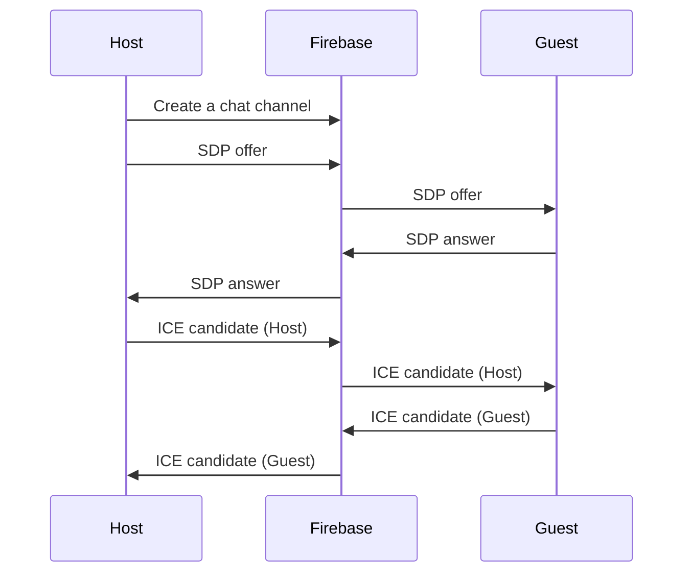

# WebRTC iOS VideoChat

This is an example implementation of iOS WebRTC video VideoChat.


Establishing [WebRTC](https://developer.mozilla.org/en-US/docs/Web/API/WebRTC_API) connection consists of multiple asynchronous steps where data is exchanged over the network:
* communication with [STUN/TURN servers](https://developer.mozilla.org/en-US/docs/Web/API/WebRTC_API/Protocols)
* communication with [signaling server (Firebase in this case)](https://developer.mozilla.org/en-US/docs/Web/API/WebRTC_API/Connectivity#signaling)

 Error handling and connection reset is tricky and can result in [callback hell](http://callbackhell.com/).

The project presents:
* approach to establishing a reliable WebRTC connection every time two peers try to connect to each other.
* error handling and reliable connection reset

Technologies used:
* [WebRTC](https://developer.mozilla.org/en-US/docs/Web/API/WebRTC_API)
* [Swift programming language](https://docs.swift.org/swift-book/)
* [Swift structured concurrency](https://docs.swift.org/swift-book/LanguageGuide/Concurrency.html)
* [SwiftUI](https://developer.apple.com/xcode/swiftui/)
* [Firebase firestore](https://firebase.google.com/docs/firestore)

## Core algorithm

Two peers connecting to each other are called: `host` and `guest`. Core algorithm consists of two main steps:
* SDP exchange
* ICE candidates exchange

Each step has a timeout associated to it - if the step is not completed within the timeframe the whole flow is reset.
The flow can also be reset due to peer clearing it's connection data (SDP, ICE candidates) on signaling server. Clearing connection data is done in the outer connection loop. This could happen e.g. due to connection timeout.

```mermaid
flowchart TD
    S[Start]-->A
    A[SDP exchange] -->|SDP exchange timeout| B{Timeout?}
    B -->|Reset connection| S
    A --> C{Is host?}
    C --> D[SDP offer]
    D -->|Wait for guest SDP| O(SDP received)
    A --> E{Is guest?}
    E -->|Wait for host SDP| F[SDP received]
    F --> G[SDP answer]
    G --> H[SDP Exchanged]
    O --> H
    H -->|Candidates exchange timeout| I{Timeout?}
    I -->|Reset connection|S
    H -->J[Exchange candidates]
       M -->N[Connected]
    H -->|Check if peer data removed|K{Peer reset?}
    K -->|Reset connection|S
    H -->|Check connection error|L{Error}
    L -->|Reset connection|S
    H -->M{Connected?}
 ```
 <p align = "center">
 Implemented WebRTC connection algorithm
 </p>


```Swift
try await withThrowingTaskGroup(of: Void.self) { group in
    group.addTask {
        if let rtcSessionDescription = try await signalingClient.getRTCSessionDescriptions(
            currentPeer.watchKey,
            chatRoomId
        ).first(where: { _ in true }) {
            try await webRTCClient.set(remoteSdp: rtcSessionDescription)
            connectionStateContainer.info = "Remote SDP set"
            if currentPeer == .guest {
                let sdp = try await webRTCClient.answer()
                try await signalingClient.send(sdp: sdp, chatRoomId: chatRoomId, collection: currentPeer.sendKey)
                connectionStateContainer.info = "SDP answer sent"
            }
        }
    }
    if currentPeer == .host {
        group.addTask {
            let sdp = try await webRTCClient.offer()
            try await signalingClient.send(sdp: sdp, chatRoomId: chatRoomId, collection: currentPeer.sendKey)
            connectionStateContainer.info = "SDP offer sent"
        }
    }
    group.addTask {
        for _ in 1...40 {
            if webRTCClient.isRemoteDescriptionSet {
                return
            }
            try await Task.sleep(milliseconds: 100)
        }
        connectionStateContainer.info = "Connection timeout"
        throw connectionError.connectionTimeoutError
    }
    try await group.waitForAll()
}
connectionStateContainer.info = "RTC exchanged"
try await withThrowingTaskGroup(of: Void.self) { group in
    group.addTask {
        for try await candidate in signalingClient.getCandidates(currentPeer.watchKey, chatRoomId) {
            try await webRTCClient.set(remoteCandidate: candidate)
        }
        connectionStateContainer.info = "Candidates set"
    }
    group.addTask {
        for await state in webRTCClient.getConnectionState() where state == .failed {
            connectionStateContainer.info = "Connection failed"
            throw connectionError.connectionFailed
        }
    }
    group.addTask {
        try await Task.sleep(seconds: 15)
        if connectionStateContainer.state != .connected {
            connectionStateContainer.info = "Connection timeout"
            throw connectionError.connectionTimeoutError
        }
    }
    group.addTask {
        // peer has deleted sdp and candidates - reset connection
        try await signalingClient.waitUntilSdpAndCandidatesDeleted(
            collection: currentPeer.watchKey,
            chatRoomId: chatRoomId)
        connectionStateContainer.info = "Peer connection reset"
        throw connectionError.connectionReset
    }
    try await group.waitForAll()
}
```
<p align = "center">
Content of WebRTC connection loop
</p>

## Signaling server

>Unfortunately, WebRTC can't create connections without some sort of server in the middle. We call this the signal channel or signaling service. It's any sort of channel of communication to exchange information before setting up a connection, whether by email, postcard, or a carrier pigeon. It's up to you.



<p align = "center">
Firebase as signaling server
</p>

## Unit tests

Project contains multiple unit tests:
* `testSimultaneousConnection()`
* `testGuestConnectingFirst()`
* `testHostConnectingFirst()`
* `testHostDisconnected()`
* `testGuestDisconnected()`
* `testRandomConnectionScheme()`

```Swift
private func simulateConnection(
    _ chatRoomId: String,
    guestDelaySec: Int = 0,
    hostDelaySec: Int = 0) async
{
    let guestWebRTCManager = WebRTCManager()
    let hostWebRTCManager = WebRTCManager()
    let t = Task {
        try await Task.sleep(nanoseconds: 1_000_000_000 * UInt64(guestDelaySec))
        await guestWebRTCManager.retryConnect(
            chatRoomId: chatRoomId,
            currentPeer: WebRTCManager.peer.guest
        )
    }
    let t2 = Task {
        try await Task.sleep(nanoseconds: 1_000_000_000 * UInt64(hostDelaySec))
        await hostWebRTCManager.retryConnect(
            chatRoomId: chatRoomId,
            currentPeer: WebRTCManager.peer.host
        )
    }
    let t3 = Task {
        for await connectionState in guestWebRTCManager.connectionState {
            if connectionState == .connected {
                t.cancel()
                break
            }
        }
    }
    let t4 = Task {
        for await connectionState in hostWebRTCManager.connectionState {
            if connectionState == .connected {
                t2.cancel()
                break
            }
        }
    }
    await t3.value
    await t4.value
}
```
<p align = "center">
Function used to simulate simultaneous connection
</p>

## Setup guide

* Execute `pod install` command inside the cloned `VideoChat` directory - this will install WebRTC dependency. Unoficial WebRTC CocoaPods distribution is used in this project. For production applications you should [build your own version of WebRTC library](https://webrtc.github.io/webrtc-org/native-code/ios/).
* Create a new [Firebase project](https://firebase.google.com/)
* Add iOS app to the newly created Firebase project
* Download GoogleService-Info.plist and put it into VideoChat directory of the project
* Create Cloud Firestore database (Test mode) in Firebase Console

## References

* WebRTC website: https://webrtc.org/
* WebRTC source code: https://webrtc.googlesource.com/src
* WebRTC iOS compile guide: https://webrtc.github.io/webrtc-org/native-code/ios/
* WebRTC-iOS example: https://github.com/stasel/WebRTC-iOS   
